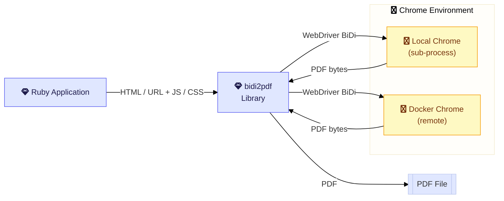

[](https://github.com/dieter-medium/bidi2pdf/blob/main/.github/workflows/ruby.yml)
[](https://codeclimate.com/github/dieter-medium/bidi2pdf/maintainability)
[](https://badge.fury.io/rb/bidi2pdf)
[](https://www.codetriage.com/dieter-medium/bidi2pdf)

---

# 📄 Bidi2pdf – Bulletproof PDF generation via Chrome's BiDi Protocol

**Bidi2pdf** is a powerful Ruby gem that transforms modern web pages into high-fidelity PDFs using Chrome’s
**BiDirectional (BiDi)** protocol. Whether you're automating reports, archiving websites, or shipping documentation,
Bidi2pdf gives you **precision, flexibility, and full control**.

---

## 📚 Table of Contents

1. [Key Features](#key-features)
2. [Quick Start](#quick-start)
3. [Why BiDi?](#why-bidi-instead-of-cdp)
4. [Installation](#installation)
5. [CLI Usage](#cli-usage)
6. [Library API](#library-api)
7. [Architecture](#architecture)
8. [Docker](#docker)
9. [Configuration Options](#configuration-options)
10. [Programmatic Configuration](#programmatic-configuration)
11. [Rails Integration](#rails-integration)
12. [Test Helpers](#test-helpers)
13. [Development](#development)
14. [Contributing](#contributing)
15. [License](#license)

## ✨ Key Features

✅ **One-liner CLI** – From URL to PDF in a single command  
✅ **Full customization** – Inject cookies, headers, auth credentials  
✅ **Smart waiting** – Wait for complete page load or network idle  
✅ **Headless support** – Run quietly in the background  
✅ **Docker-ready** – Plug and play with containers  
✅ **Modern architecture** – Built on Chrome's next-gen BiDi protocol  
✅ **Network logging** – Know which requests fail during rendering  
✅ **Console log capture** – See what goes wrong inside the browser

---

## ⚡ Quick Start

Get up and running in three easy steps:

```bash
# 1. Install the gem (system-wide)
gem install bidi2pdf

# 2. Render any page to PDF
bidi2pdf render --url https://example.com --output example.pdf

# 3. Open the PDF (macOS shown; use xdg-open on Linux)
open example.pdf
```

> **Bundler users** – Add it to your project with `bundle add bidi2pdf`.

---

## 🚀 Installation

### Bundler

```ruby
gem 'bidi2pdf'
```

### Standalone

```bash
gem install bidi2pdf
```

### Requirements

- **Ruby** ≥ 3.3
- **Chrome/Chromium**
- Automatic ChromeDriver management via [chromedriver-binary](https://github.com/dieter-medium/chromedriver-binary)

---

## ⚙️ Basic Usage

### Command-line

```bash
bidi2pdf render --url https://example.com/invoice/14432423 --output example.pdf
```

### Advanced CLI Options

```bash
bidi2pdf render \
  --url https://example.com/invoice/14432423 \
  --output example.pdf \
  --cookie session=abc123 \
  --header X-API-KEY=token \
  --auth admin:password \
  --wait_network_idle \
  --wait_window_loaded \
  --log-level debug
```

---

## 🧠 Programmatic API

### Classic Approach

```ruby
require 'bidi2pdf'

launcher = Bidi2pdf::Launcher.new(
  url: 'https://example.com/invoice/14432423',
  output: 'example.pdf',
  cookies: { 'session' => 'abc123' },
  headers: { 'X-API-KEY' => 'token' },
  auth: { username: 'admin', password: 'password' },
  wait_window_loaded: true,
  wait_network_idle: true
)

launcher.launch
```

### DSL – Quick & Clean

```ruby
require "bidi2pdf"

Bidi2pdf::DSL.with_tab(headless: true) do |tab|
  tab.navigate_to("https://example.com/invoice/14432423")
  tab.wait_until_network_idle
  tab.print("example.pdf")
end
```

---

## 🧬 Deep Integration Example

Get fine-grained control using Chrome sessions, tabs, and BiDi commands:

<details>
<summary>🔍 Show full example</summary>

```ruby
require "bidi2pdf"

# 1. Remote or local session?
session = Bidi2pdf::Bidi::Session.new(
  session_url: "http://localhost:9092/session",
  headless: true,
)

# Alternative: local session via ChromeDriver
# manager = Bidi2pdf::ChromedriverManager.new(headless: false)
# manager.start
# session = manager.session

session.start
session.client.on_close { puts "WebSocket session closed" }

# 2. Create browser/tab
browser = session.browser
context = browser.create_user_context
window = context.create_browser_window
tab = window.create_browser_tab

# 3. Inject configuration
tab.set_cookie(name: "auth", value: "secret", domain: "example.com", secure: true)
tab.add_headers(url_patterns: [{ type: "pattern", protocol: "https", hostname: "example.com", port: "443" }],
                headers: [{ name: "X-API-KEY", value: "12345678" }])
tab.basic_auth(url_patterns: [{ type: "pattern", protocol: "https", hostname: "example.com", port: "443" }],
               username: "username", password: "secret")

# 4. Render PDF
tab.navigate_to "https://example.com/invoice/14432423"

# Alternative: send html code to the browser
# tab.render_html_content("<html>...</html>")

# Inject JavaScript if, needed
# as an url
# tab.inject_script "https://example.com/script.js" 
# or inline
# tab.inject_script "console.log('Hello from injected script!')"

# Inject CSS if needed
# as an url
# tab.inject_style url: "https://example.com/simple.css"
# or inline
# tab.inject_style content: "body { background-color: red; }"

tab.wait_until_network_idle
tab.print("my.pdf")

# 5. Cleanup
tab.close
window.close
context.close
session.close
```

</details>

---

## 🌐 Architecture


```mermaid
%%{  init: {
      "theme": "base",
      "themeVariables": {
        "primaryColor":  "#E0E7FF",
        "secondaryColor":"#FEF9C3",
        "edgeLabelBackground":"#FFFFFF",
        "fontSize":"14px",
        "nodeBorderRadius":"6"
      }
    }
}%%
flowchart LR
%% ----- Ruby side ---------
    A["fa:fa-gem Ruby Application"]
    B["fa:fa-gem bidi2pdf<br/>Library"]
%% ----Chrome environment -----------
    subgraph C["fa:fa-chrome Chrome Environment"]
        direction TB
        C1["fa:fa-chrome Local Chrome<br/>(sub-process)"]
        C2["fa:fa-docker Docker Chrome<br/>(remote)"]
    end

    D[[PDF File]]
%% ---- Data / control flows ------
    A -- " HTML / URL + JS / CSS " --> B
    B -- " WebDriver BiDi " --> C1
    B -- " WebDriver BiDi " --> C2
    C1 -- " PDF bytes " --> B
    C2 -- " PDF bytes " --> B
    B -- " PDF " --> D
%% --- Optional extra styling classes (for future tweaks) ---
    classDef ruby fill:#E0E7FF,stroke:#6366F1,color:#1E1B4B;
    classDef chrome fill:#FEF9C3,stroke:#F59E0B,color:#78350F;
    class A,B ruby;
    class C1,C2 chrome;
```

---

## 🐳 Docker Support

### 🛠️ Build & Run Locally

```bash
# Prepare the environment
rake build

# Build the Docker image
docker build -t bidi2pdf -f docker/Dockerfile .

# Run the container and generate a PDF
docker run -it --rm \
  -v ./output:/reports \
  bidi2pdf \
  bidi2pdf render --url=https://example.com/invoice/14432423 --output /reports/example.pdf

```

### ⚡ Use the Prebuilt Image (Recommended for Fast Start)

Grab it directly from [Docker Hub](https://hub.docker.com/r/dieters877565/bidi2pdf)

```bash
docker run -it --rm \
  -v ./output:/reports \
  dieters877565/bidi2pdf:main-slim \
  bidi2pdf render --url=https://example.com/invoice/14432423 --output /reports/example.pdf
```

✅ Tip: Mount your local directory (e.g. ./output) to /reports in the container to easily access the generated PDFs.

### Docker Compose

```bash
rake build
docker compose -f docker/docker-compose.yml up -d

# simple example
docker compose -f docker/docker-compose.yml exec app bidi2pdf render --url=http://nginx/sample.html --wait_window_loaded --wait_network_idle --output /reports/simple.pdf

# with a local file
docker compose -f docker/docker-compose.yml exec app bidi2pdf render --url=file:///reports/sample.html--wait_network_idle --output /reports/simple.pdf


# basic auth example
docker compose -f docker/docker-compose.yml exec app bidi2pdf render --url=http://nginx/basic/sample.html --auth admin:secret --wait_window_loaded --wait_network_idle --output /reports/basic.pdf

# header example
docker compose -f docker/docker-compose.yml exec app bidi2pdf render --url=http://nginx/header/sample.html --header "X-API-KEY=secret" --wait_window_loaded --wait_network_idle --output /reports/header.pdf

# cookie example
docker compose -f docker/docker-compose.yml exec app bidi2pdf render --url=http://nginx/cookie/sample.html --cookie "auth=secret" --wait_window_loaded --wait_network_idle --output /reports/cookie.pdf

# remote chrome example
docker compose -f docker/docker-compose.yml exec app bidi2pdf render --url=http://nginx/cookie/sample.html --remote_browser_url http://remote-chrome:3000/session --cookie "auth=secret" --wait_window_loaded --wait_network_idle --output /reports/remote.pdf

docker compose -f docker/docker-compose.yml down
```

---

## 🧩 Configuration Options

| Flag                   | Description                                |
|------------------------|--------------------------------------------|
| `--url`                | Target URL (required)                      |
| `--output`             | Output PDF file (default: output.pdf)      |
| `--cookie`             | Set cookie in `name=value` format          |
| `--header`             | Inject custom header `name=value`          |
| `--auth`               | Basic auth as `user:pass`                  |
| `--headless`           | Run Chrome headless (default: true)        |
| `--port`               | ChromeDriver port (0 = auto)               |
| `--wait_window_loaded` | Wait until `window.loaded` is set to true  |
| `--wait_network_idle`  | Wait until network is idle                 |
| `--log_level`          | Log level: debug, info, warn, error, fatal |
| `--remote_browser_url` | Connect to remote Chrome session           |
| `--default_timeout`    | Operation timeout (default: 60s)           |

---

## 🔧 Programmatic Configuration

Beyond the per-render CLI flags above, a few gem-wide defaults are set once via `Bidi2pdf.configure`:

```ruby
Bidi2pdf.configure do |config|
  config.default_timeout = 60 # seconds - default BiDi command timeout
  config.enable_default_logging_subscriber = true
  config.log_truncate_limit = 200 # bytes - see below
  config.chromedriver_log_level = "WARNING" # see below
end
```

| Setting                             | Default | Description                                                                                                                                                                                                                      |
|-------------------------------------|---------|----------------------------------------------------------------------------------------------------------------------------------------------------------------------------------------------------------------------------------|
| `default_timeout`                   | `60`    | Default timeout (seconds) for BiDi commands that don't specify their own.                                                                                                                                                        |
| `enable_default_logging_subscriber` | `true`  | Subscribes a default logger to the gem's internal instrumentation events.                                                                                                                                                        |
| `log_truncate_limit`                | `200`   | Max bytes kept when logging a value that can be large (e.g. a `data:` URL) - truncated at a byte, not character, boundary.                                                                                                       |
| `chromedriver_log_level`            | `nil`   | ChromeDriver's own `--log-level` (`"ALL"`/`"INFO"`/`"WARNING"`/`"SEVERE"`). Unset mirrors `Bidi2pdf.logger.level`; set explicitly to quiet ChromeDriver's own (often very verbose) output independently of your app's log level. |

`Bidi2pdf.logger`, `Bidi2pdf.network_events_logger`, `Bidi2pdf.browser_console_logger`, and
`Bidi2pdf.notification_service` are also configurable in the same block, for more advanced
logging/instrumentation needs.

### Pre-warmed sessions (`Bidi2pdf::SessionWarmer`)

Optional. Keeps a few Chrome sessions started in the background so a render skips browser startup.
Every slot is still used for exactly one render and then discarded - isolation is the same as
launching a fresh Chrome per PDF.

```ruby
Bidi2pdf::SessionWarmer.configure do |c|
  # warms c.size sessions right here, e.g. at boot
  c.size = 2
  c.max_idle_age = 300
  # c.remote_browser_url = "http://remote-chrome:3000/session"
end

Bidi2pdf::SessionWarmer.with_tab do |tab|
  tab.navigate_to(url)
  tab.print("invoice.pdf")
end

Bidi2pdf::SessionWarmer.shutdown
```

| Setting              | Default               | Description                                                                                               |
|----------------------|-----------------------|-----------------------------------------------------------------------------------------------------------|
| `size`               | `1`                   | Number of sessions kept warm. With none ready, a render starts its own session as usual - it never waits. |
| `max_idle_age`       | `300`                 | Seconds a warm session may sit unused before it is retired and replaced. `nil` disables the limit.        |
| `headless`           | `true`                | Run Chrome headless.                                                                                      |
| `chrome_args`        | `DEFAULT_CHROME_ARGS` | Chrome launch arguments.                                                                                  |
| `remote_browser_url` | `nil`                 | Connect each slot to a remote chromedriver instead of starting a local one.                               |

> **Security note:** an idle warm session is an open, unauthenticated automation endpoint
> (chromedriver's port, Chrome's debugging port - loopback only for a local chromedriver) for as
> long as it waits. `max_idle_age` bounds that window; keep it set unless the process runs somewhere
> nothing else can reach those ports. With `remote_browser_url`, who can reach that endpoint on the
> network is what matters, exactly as it does without the warmer.

### Customizing Chrome arguments (and blank PDFs from inline HTML)

`Bidi2pdf::Bidi::Session::DEFAULT_CHROME_ARGS` already contains one `--disable-features=...` entry,
and Chrome only honors the **last** occurrence of that switch. To turn another feature off, extend
that entry instead of appending a second switch, which would silently drop the defaults:

```ruby
chrome_args = Bidi2pdf::Bidi::Session::DEFAULT_CHROME_ARGS.map do |arg|
  arg.start_with?("--disable-features=") ? "#{arg},LocalNetworkAccessChecks" : arg
end
```

`LocalNetworkAccessChecks` is the one you are most likely to need. HTML rendered through
`BrowserTab#render_html_content` is loaded as a `data:` URL, which Chrome treats as a public origin;
if that HTML references assets on a private address (`localhost`, a Docker hostname, ...), recent
Chrome versions (confirmed with Chrome 153) block those requests before they are sent. Nothing
raises - the assets show up as failed network events, the server never sees a request, and the PDF
comes out unstyled or blank. Disable the check only where the asset host really is private, and keep
it on when rendering pages you do not control.
The [bidi2pdf-rails README](https://github.com/dieter-medium/bidi2pdf-rails#readme) has the full
walkthrough under "Blank PDFs: Chrome's Local Network Access Check".

---

## 🚂 Rails Integration

Rails integration is available as an additional gem:

```ruby
# In your Gemfile
gem 'bidi2pdf-rails'
```

For full documentation and usage examples,
visit: [https://github.com/dieter-medium/bidi2pdf-rails](https://github.com/dieter-medium/bidi2pdf-rails)

---

## 🧪 Test Helpers

Bidi2pdf provides a suite of RSpec helpers (activated with `pdf: true`) to
simplify PDF-related testing:

### SpecPathsHelper

– `spec_dir` → returns your spec directory  
– `tmp_dir` → returns your tmp directory  
– `tmp_file(*parts)` → builds a tmp file path  
– `random_tmp_dir(*dirs, prefix:)` → builds a random tmp directory

- `fixture_file(*parts)` → returns the path to a fixture file

### PdfFileHelper

– `with_pdf_debug(pdf_data) { |data| … }` → on failure, writes PDF to disk  
– `store_pdf_file(pdf_data, filename_prefix = "test")` → saves PDF and returns path

### Rspec Matchers

- `have_pdf_page_count` → checks if the PDF has a specific number of pages
- `match_pdf_text` → checks if the PDF equals a specific text, after stripping whitespace and normalizing characters
- `contains_pdf_text` → checks if the PDF contains a specific text, after stripping whitespace and normalizing
  characters, supporting regex
- `contains_pdf_image` → checks if the PDF contains a specific image

### ChromedriverContainer

`require "bidi2pdf/test_helpers/testcontainers"` you can use the `chromedriver_container` helper to
start a ChromeDriver container for your tests. This is useful if you don't want to run ChromeDriver locally
or if you want to ensure a clean environment for your tests.

This also provides the helper methods:

- `session_url` → returns the session URL for the ChromeDriver container
- `chromedriver_container` → returns the Testcontainers container object
- `create_session` -> creates a `Bidi2pdf::Bidi::Session` object for the ChromeDriver container

With the environment variable `DISABLE_CHROME_SANDBOX` set to `true`, the container will run Chrome without
the sandbox. This is useful for CI environments where the sandbox may cause issues.

Container URLs (`session_url` and similar) are built from the Docker host's address plus the container's
mapped port. That address is resolved by the `testcontainers` gem — which already handles a `tcp:`/`ssh:`
`DOCKER_HOST`, a native local daemon, and a sibling container reaching the daemon over the bridge gateway —
falling back to `"localhost"` only if the gem can't resolve a host at all (a known gap in
`testcontainers-core` 0.2.0 when the test process itself runs in a container on a custom network).

To override the Docker host address explicitly, set `TC_HOST` (e.g. `TC_HOST=localhost` for a test process
running in a container that shares the Docker daemon's network namespace — true docker-in-docker). `TC_HOST`
is a single global setting for where the daemon's published ports are reachable; it is not the name, URL, or
IP of an individual container. To reach one container *from another* container, join the shared network and
address it by alias instead (see `nginx_url(use_alias: true)` in the spec helpers).

#### Example

```ruby
require "bidi2pdf/test_helpers"
require "bidi2pdf/test_helpers/images" # <= for image matching, requires lib-vips
require "bidi2pdf/test_helpers/testcontainers" # <= requires testcontainers gem

RSpec.describe "PDF generation", :pdf, :chromedriver do
  it "generates a PDF with the correct content" do
    pdf_data = generate_pdf("https://example.com/invoice/14432423")
    expect(pdf_data).to have_pdf_page_count(1)
    expect(pdf_data).to match_pdf_text("Hello, world!")
    expect(pdf_data).to contain_pdf_image(fixture_file("logo.png"))
  end
end
```

---

## 🛠 Development

```bash
# Setup
bin/setup

# Run tests
rake spec

# Open interactive console
bin/console
```

---

## 📜 License

This project is licensed under the [MIT License](https://opensource.org/licenses/MIT).
