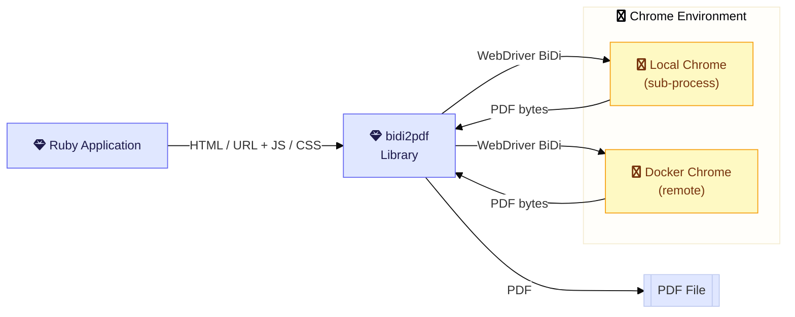

[](https://github.com/dieter-medium/bidi2pdf/blob/main/.github/workflows/ruby.yml)
[](https://codeclimate.com/github/dieter-medium/bidi2pdf/maintainability)
[](https://badge.fury.io/rb/bidi2pdf)
[](https://www.codetriage.com/dieter-medium/bidi2pdf)

---

# 📄 Bidi2pdf – Bulletproof PDF generation via Chrome's BiDi Protocol

**Bidi2pdf** is a powerful Ruby gem that transforms modern web pages into high-fidelity PDFs using Chrome’s
**BiDirectional (BiDi)** protocol. Whether you're automating reports, archiving websites, or shipping documentation,
Bidi2pdf gives you **precision, flexibility, and full control**.

---

## 📚 Table of Contents

1. [Key Features](#key-features)
2. [Quick Start](#quick-start)
3. [Why BiDi?](#why-bidi-instead-of-cdp)
4. [Installation](#installation)
5. [CLI Usage](#cli-usage)
6. [Agent and Automation Usage](#agent-and-automation-usage)
7. [Library API](#library-api)
8. [Architecture](#architecture)
9. [Docker](#docker)
10. [Configuration Options](#configuration-options)
11. [Programmatic Configuration](#programmatic-configuration)
12. [Rails Integration](#rails-integration)
13. [Test Helpers](#test-helpers)
14. [Development](#development)
15. [Contributing](#contributing)
16. [License](#license)

## ✨ Key Features

✅ **One-liner CLI** – From URL to PDF in a single command  
✅ **Full customization** – Inject cookies, headers, auth credentials  
✅ **Smart waiting** – Wait for complete page load or network idle  
✅ **Headless support** – Run quietly in the background  
✅ **Docker-ready** – Plug and play with containers  
✅ **Modern architecture** – Built on Chrome's next-gen BiDi protocol  
✅ **Network logging** – Know which requests fail during rendering  
✅ **Console log capture** – See what goes wrong inside the browser  
✅ **Agent-ready** – Structured JSON output, NDJSON progress streaming, a page diagnostic, and
declarative recipes, so LLM agents and CI can drive it without parsing logs

---

## ⚡ Quick Start

Get up and running in three easy steps:

```bash
# 1. Install the gem (system-wide)
gem install bidi2pdf

# 2. Render any page to PDF
bidi2pdf render --url https://example.com --output example.pdf

# 3. Open the PDF (macOS shown; use xdg-open on Linux)
open example.pdf
```

> **Bundler users** – Add it to your project with `bundle add bidi2pdf`.

---

## 🚀 Installation

### Bundler

```ruby
gem 'bidi2pdf'
```

### Standalone

```bash
gem install bidi2pdf
```

### Requirements

- **Ruby** ≥ 3.3
- **Chrome/Chromium**
- Automatic ChromeDriver management via [chromedriver-binary](https://github.com/dieter-medium/chromedriver-binary)

---

## ⚙️ Basic Usage

### Command-line

```bash
bidi2pdf render --url https://example.com/invoice/14432423 --output example.pdf
```

### Advanced CLI Options

```bash
bidi2pdf render \
  --url https://example.com/invoice/14432423 \
  --output example.pdf \
  --cookie session=abc123 \
  --header X-API-KEY=token \
  --auth admin:password \
  --wait_network_idle \
  --wait_window_loaded \
  --log-level debug
```

---

## 🤖 Agent and Automation Usage

Every command below also works without `--json` (human-readable output on stdout); with it, stdout
carries exactly one JSON document and nothing else - safe to pipe into `jq` or parse directly.
Human-readable logs move to stderr for the duration of any `--json`/`--output -` call, never
mixing into stdout. `--json-stream` works independently of the two: it always writes progress
events to stderr, whether or not `--json` is also given - in human mode, that just means
human-readable output keeps going to stdout as usual, alongside the stream. Full JSON Schema for
every shape is built into the gem, so an agent can discover it without reading this file:

```bash
# 1. Check compatibility first - no browser launched
bidi2pdf version --json

# 2. Discover the shape of each command's own result, a manifest, an NDJSON event, or a recipe file
bidi2pdf schema render
bidi2pdf schema diagnose
bidi2pdf schema run
bidi2pdf schema manifest
bidi2pdf schema event
bidi2pdf schema recipe

# 3. Validate a recipe - no browser launched, the cheapest way to iterate on one
bidi2pdf run recipe.yml --validate

# 4. Run it for real
bidi2pdf run recipe.yml --json
```

### Structured render output

```bash
bidi2pdf render --url https://example.com/invoice/14432423 --output example.pdf --json
```

```json
{
  "schema_version": 1,
  "ok": true,
  "command": "render",
  "output": "example.pdf",
  "bytes": 182734,
  "sha256": "abcd...",
  "pages": 2,
  "duration_ms": 842,
  "navigation": { "requested_url": "https://example.com/invoice/14432423", "final_url": "https://example.com/invoice/14432423", "status": 200 },
  "console": [],
  "network_failures": [],
  "warnings": [],
  "error": null
}
```

`pages` is `null`, with a warning explaining why, when the optional `pdf-reader` gem isn't
installed - see [Docker](#docker) for why the published images always have it. A failed render
still emits exactly this shape, with `ok: false` and a structured `error` (`code`, `message`,
`retryable`, `hint`, `details`) instead of a stack trace:

| Exit code | Meaning |
|---|---|
| `0` | success |
| `2` | CLI, configuration, or recipe-validation error |
| `3` | browser or navigation error |
| `4` | page not as expected (a recipe action/assertion, or a diagnose selector, failed) |
| `6` | output or PDF generation failure |
| `70` | unexpected internal error |

### stdin/stdout, manifests, and progress streaming

```bash
# Render HTML piped on stdin, PDF bytes piped out on stdout - no files touched
cat page.html | bidi2pdf render --stdin --output - > page.pdf

# A render manifest: enough to reproduce and diagnose the render later
bidi2pdf render --url https://example.com --output example.pdf --manifest render.json

# One JSON progress event per stderr line as the render happens - works with human-readable
# output too, not just --json
bidi2pdf render --url https://example.com --output example.pdf --json-stream
```

### Diagnosing a page before trusting its PDF

`bidi2pdf diagnose` loads a page like `render` does but produces no PDF - it answers *why does the
PDF not look like the page* (console errors, failed requests, font-loading status, `@media
print`/`@page` rules, fixed/sticky elements, Paged.js detection), not what the page's content is:

```bash
bidi2pdf diagnose --url https://example.com/invoice/14432423 --json
```

### Declarative recipes

A recipe is a rendering contract - the waits a page needs before it's printed, and the properties
the resulting PDF must have - not a general browser-automation script:

```yaml
# invoice.yml
version: 1

source:
  url: https://example.com/invoice/123

actions:
  - wait_for:
      selector: "#invoice"
      timeout: 10
  - click:
      selector: "#show-details"
  - wait_network_idle:
      timeout: 10

assert:
  - selector_exists:
      selector: "#total"
  - no_console_errors: true
  - page_count: 2
  - pdf_text_present:
      text: "Invoice #123"

output:
  pdf: invoice.pdf
  manifest: invoice.json
```

```bash
bidi2pdf run invoice.yml --validate   # schema + known actions/assertions, no browser
bidi2pdf run invoice.yml --json       # actions, then the PDF, then assertions against it
```

Actions (`wait_for`, `click`, `evaluate`, `inject_script`, `inject_style`, `set_viewport`,
`wait_network_idle`) and page assertions (`selector_exists`, `text_present`, `no_console_errors`,
`no_network_failures`, `fonts_loaded`) are a thin layer over the same `BrowserTab` methods the
[Programmatic API](#-programmatic-api) below uses directly. PDF assertions (`page_count`,
`pdf_text_present`, `pdf_not_blank`) need the `pdf-reader` gem - a recipe using one fails
`--validate` immediately, before any browser launches, when it isn't installed.

`no_console_errors`, `no_network_failures`, `fonts_loaded`, and `pdf_not_blank` are presence-only
assertions - the step is either there or it isn't, nothing reads the value beside it - so they must
be written as `true` exactly, e.g. `- no_console_errors: true`; `false` (or any other value) is
rejected by both `bidi2pdf schema recipe` and `--validate` rather than being silently ignored.
`wait_for` needs exactly one of `selector`, `paged_js`, `script` - zero or more than one is
rejected the same way, before any browser launches.

---

## 🧠 Programmatic API

### Classic Approach

```ruby
require 'bidi2pdf'

launcher = Bidi2pdf::Launcher.new(
  url: 'https://example.com/invoice/14432423',
  output: 'example.pdf',
  cookies: { 'session' => 'abc123' },
  headers: { 'X-API-KEY' => 'token' },
  auth: { username: 'admin', password: 'password' },
  wait_window_loaded: true,
  wait_network_idle: true
)

launcher.launch
```

### DSL – Quick & Clean

```ruby
require "bidi2pdf"

Bidi2pdf::DSL.with_tab(headless: true) do |tab|
  tab.navigate_to("https://example.com/invoice/14432423")
  tab.wait_until_network_idle
  tab.print("example.pdf")
end
```

---

## 🧬 Deep Integration Example

Get fine-grained control using Chrome sessions, tabs, and BiDi commands:

<details>
<summary>🔍 Show full example</summary>

```ruby
require "bidi2pdf"

# 1. Remote or local session?
session = Bidi2pdf::Bidi::Session.new(
  session_url: "http://localhost:9092/session",
  headless: true,
)

# Alternative: local session via ChromeDriver
# manager = Bidi2pdf::ChromedriverManager.new(headless: false)
# manager.start
# session = manager.session

session.start
session.client.on_close { puts "WebSocket session closed" }

# 2. Create browser/tab
browser = session.browser
context = browser.create_user_context
window = context.create_browser_window
tab = window.create_browser_tab

# 3. Inject configuration
tab.set_cookie(name: "auth", value: "secret", domain: "example.com", secure: true)
tab.add_headers(url_patterns: [{ type: "pattern", protocol: "https", hostname: "example.com", port: "443" }],
                headers: [{ name: "X-API-KEY", value: "12345678" }])
tab.basic_auth(url_patterns: [{ type: "pattern", protocol: "https", hostname: "example.com", port: "443" }],
               username: "username", password: "secret")

# 4. Render PDF
tab.navigate_to "https://example.com/invoice/14432423"

# Alternative: send html code to the browser
# tab.render_html_content("<html>...</html>")

# Inject JavaScript if, needed
# as an url
# tab.inject_script "https://example.com/script.js" 
# or inline
# tab.inject_script "console.log('Hello from injected script!')"

# Inject CSS if needed
# as an url
# tab.inject_style url: "https://example.com/simple.css"
# or inline
# tab.inject_style content: "body { background-color: red; }"

tab.wait_until_network_idle
tab.print("my.pdf")

# 5. Cleanup
tab.close
window.close
context.close
session.close
```

</details>

---

## 🌐 Architecture


```mermaid
%%{  init: {
      "theme": "base",
      "themeVariables": {
        "primaryColor":  "#E0E7FF",
        "secondaryColor":"#FEF9C3",
        "edgeLabelBackground":"#FFFFFF",
        "fontSize":"14px",
        "nodeBorderRadius":"6"
      }
    }
}%%
flowchart LR
%% ----- Ruby side ---------
    A["fa:fa-gem Ruby Application"]
    B["fa:fa-gem bidi2pdf<br/>Library"]
%% ----Chrome environment -----------
    subgraph C["fa:fa-chrome Chrome Environment"]
        direction TB
        C1["fa:fa-chrome Local Chrome<br/>(sub-process)"]
        C2["fa:fa-docker Docker Chrome<br/>(remote)"]
    end

    D[[PDF File]]
%% ---- Data / control flows ------
    A -- " HTML / URL + JS / CSS " --> B
    B -- " WebDriver BiDi " --> C1
    B -- " WebDriver BiDi " --> C2
    C1 -- " PDF bytes " --> B
    C2 -- " PDF bytes " --> B
    B -- " PDF " --> D
%% --- Optional extra styling classes (for future tweaks) ---
    classDef ruby fill:#E0E7FF,stroke:#6366F1,color:#1E1B4B;
    classDef chrome fill:#FEF9C3,stroke:#F59E0B,color:#78350F;
    class A,B ruby;
    class C1,C2 chrome;
```

---

## 🐳 Docker Support

### 🛠️ Build & Run Locally

```bash
# Prepare the environment
rake build

# Build the Docker image
docker build -t bidi2pdf -f docker/Dockerfile .

# Run the container and generate a PDF
docker run -it --rm \
  -v ./output:/reports \
  bidi2pdf \
  bidi2pdf render --url=https://example.com/invoice/14432423 --output /reports/example.pdf

```

### ⚡ Use the Prebuilt Image (Recommended for Fast Start)

Grab it directly from [Docker Hub](https://hub.docker.com/r/dieters877565/bidi2pdf)

```bash
docker run -it --rm \
  -v ./output:/reports \
  dieters877565/bidi2pdf:main-slim \
  bidi2pdf render --url=https://example.com/invoice/14432423 --output /reports/example.pdf
```

✅ Tip: Mount your local directory (e.g. ./output) to /reports in the container to easily access the generated PDFs.

✅ All images run with a read-only root filesystem (`--read-only`) as long as `/tmp` is writable,
e.g. `--tmpfs /tmp`: they point Chromium's `XDG_CONFIG_HOME`/`XDG_CACHE_HOME` there, without
which Chromium's crash handler fails to start and every launch aborts with
`chrome_crashpad_handler: --database is required`.

✅ Both published images also install [`pdf-reader`](https://github.com/yob/pdf-reader) - not a
runtime dependency of the gem itself (see [Agent and Automation Usage](#agent-and-automation-usage)) -
so `pages` and the `page_count`/`pdf_text_present`/`pdf_not_blank` recipe assertions work out of
the box in either image, no extra install step needed.

### ChromeDriver image tags

[`dieters877565/chromedriver`](https://hub.docker.com/r/dieters877565/chromedriver) is built for
`linux/amd64` and `linux/arm64` with these tags:

| Tag | Moves? | Use |
|---|---|---|
| `0.1.17` (a release) | no | a fixed Chromium, pinned together with the gem version |
| `sha-<short commit>` | only if that commit is built again by hand | a fix on `main` not released yet |
| `latest`, `main` | yes, every push to `main` | the newest build and its Chromium security fixes |

Chromium comes from Debian's packages at build time, so every build can carry a different
Chromium - for a byte-exact pin use the digest (`docker buildx imagetools inspect <image:tag>`).

### Docker Compose

```bash
rake build
docker compose -f docker/docker-compose.yml up -d

# simple example
docker compose -f docker/docker-compose.yml exec app bidi2pdf render --url=http://nginx/sample.html --wait_window_loaded --wait_network_idle --output /reports/simple.pdf

# with a local file
docker compose -f docker/docker-compose.yml exec app bidi2pdf render --url=file:///reports/sample.html--wait_network_idle --output /reports/simple.pdf


# basic auth example
docker compose -f docker/docker-compose.yml exec app bidi2pdf render --url=http://nginx/basic/sample.html --auth admin:secret --wait_window_loaded --wait_network_idle --output /reports/basic.pdf

# header example
docker compose -f docker/docker-compose.yml exec app bidi2pdf render --url=http://nginx/header/sample.html --header "X-API-KEY=secret" --wait_window_loaded --wait_network_idle --output /reports/header.pdf

# cookie example
docker compose -f docker/docker-compose.yml exec app bidi2pdf render --url=http://nginx/cookie/sample.html --cookie "auth=secret" --wait_window_loaded --wait_network_idle --output /reports/cookie.pdf

# remote chrome example
docker compose -f docker/docker-compose.yml exec app bidi2pdf render --url=http://nginx/cookie/sample.html --remote_browser_url http://remote-chrome:3000/session --cookie "auth=secret" --wait_window_loaded --wait_network_idle --output /reports/remote.pdf

docker compose -f docker/docker-compose.yml down
```

---

## 🧩 Configuration Options

| Flag                   | Description                                |
|------------------------|--------------------------------------------|
| `--url`                | Target URL (required)                      |
| `--output`             | Output PDF file (default: output.pdf)      |
| `--cookie`             | Set cookie in `name=value` format          |
| `--header`             | Inject custom header `name=value`          |
| `--auth`               | Basic auth as `user:pass`                  |
| `--headless`           | Run Chrome headless (default: true)        |
| `--port`               | ChromeDriver port (0 = auto)               |
| `--wait_window_loaded` | Wait until `window.loaded` is set to true  |
| `--wait_network_idle`  | Wait until network is idle                 |
| `--log_level`          | Log level: debug, info, warn, error, fatal |
| `--remote_browser_url` | Connect to remote Chrome session           |
| `--default_timeout`    | Operation timeout (default: 60s)           |
| `--json`                | Emit a single structured JSON result document (see `bidi2pdf schema render`) |
| `--json_stream`         | Emit one JSON progress event per line to stderr (see `bidi2pdf schema event`) - works with or without `--json` |
| `--stdin`               | Read the HTML document from stdin, instead of `--url`/`--html-file`         |
| `--output -`            | Write raw PDF bytes to stdout instead of a file                             |
| `--manifest FILE`       | Write a render manifest (see `bidi2pdf schema manifest`) to `FILE`          |

See [Agent and Automation Usage](#agent-and-automation-usage) above for `bidi2pdf diagnose`,
`bidi2pdf run recipe.yml`, `bidi2pdf schema <kind>`, and `bidi2pdf version --json` - a separate
set of commands with their own options, not additional flags on `render`.

---

## 🔧 Programmatic Configuration

Beyond the per-render CLI flags above, a few gem-wide defaults are set once via `Bidi2pdf.configure`:

```ruby
Bidi2pdf.configure do |config|
  config.default_timeout = 60 # seconds - default BiDi command timeout
  config.enable_default_logging_subscriber = true
  config.log_truncate_limit = 200 # bytes - see below
  config.chromedriver_log_level = "WARNING" # see below
end
```

| Setting                             | Default | Description                                                                                                                                                                                                                      |
|-------------------------------------|---------|----------------------------------------------------------------------------------------------------------------------------------------------------------------------------------------------------------------------------------|
| `default_timeout`                   | `60`    | Default timeout (seconds) for BiDi commands that don't specify their own.                                                                                                                                                        |
| `enable_default_logging_subscriber` | `true`  | Subscribes a default logger to the gem's internal instrumentation events.                                                                                                                                                        |
| `log_truncate_limit`                | `200`   | Max bytes kept when logging a value that can be large (e.g. a `data:` URL) - truncated at a byte, not character, boundary.                                                                                                       |
| `chromedriver_log_level`            | `nil`   | ChromeDriver's own `--log-level` (`"ALL"`/`"INFO"`/`"WARNING"`/`"SEVERE"`). Unset mirrors `Bidi2pdf.logger.level`; set explicitly to quiet ChromeDriver's own (often very verbose) output independently of your app's log level. |

`Bidi2pdf.logger`, `Bidi2pdf.network_events_logger`, `Bidi2pdf.browser_console_logger`, and
`Bidi2pdf.notification_service` are also configurable in the same block, for more advanced
logging/instrumentation needs.

### Pre-warmed sessions (`Bidi2pdf::SessionWarmer`)

Optional. Keeps a few Chrome sessions started in the background so a render skips browser startup.
Every slot is still used for exactly one render and then discarded - isolation is the same as
launching a fresh Chrome per PDF.

```ruby
Bidi2pdf::SessionWarmer.configure do |c|
  # warms c.size sessions right here, e.g. at boot
  c.size = 2
  c.max_idle_age = 300
  # c.remote_browser_url = "http://remote-chrome:3000/session"
end

Bidi2pdf::SessionWarmer.with_tab do |tab|
  tab.navigate_to(url)
  tab.print("invoice.pdf")
end

Bidi2pdf::SessionWarmer.shutdown
```

| Setting              | Default               | Description                                                                                               |
|----------------------|-----------------------|-----------------------------------------------------------------------------------------------------------|
| `size`               | `1`                   | Number of sessions kept warm. With none ready, a render starts its own session as usual - it never waits. |
| `max_idle_age`       | `300`                 | Seconds a warm session may sit unused before it is retired and replaced. `nil` disables the limit.        |
| `headless`           | `true`                | Run Chrome headless.                                                                                      |
| `chrome_args`        | `DEFAULT_CHROME_ARGS` | Chrome launch arguments.                                                                                  |
| `remote_browser_url` | `nil`                 | Connect each slot to a remote chromedriver instead of starting a local one.                               |
| `orphan_age`         | `:auto`               | Remote only: on start, close sessions other warmers left behind older than this (`:auto` = 2 × `max_idle_age`, `nil` = off). |
| `registry_dir`       | `Dir.tmpdir`          | Where the session registry file lives - every process that should clean up after the others must share it. |
| `sweeper`            | `nil`                 | Remote only: settings for a [`ChromeSweeper`](#leaked-chrome-sessions-bidi2pdfchromesweeper) on the same chromedriver, e.g. `{ scope: :all, max_sessions: :auto, pids_limit: 1024, interval: 60 }`. The warmer's own sessions are never touched; `Bidi2pdf::SessionWarmer.sweep!` sweeps on demand. With a sweeper the warmer records its sessions even when `orphan_age` is `nil`. |

#### Leftover sessions on a shared chromedriver

A remote chromedriver keeps a session - a whole Chrome - until someone deletes it. A warmer closes
its own sessions when they idle past `max_idle_age` and when the process shuts down cleanly, but a
process that is killed or crashes leaves its sessions open, and enough of them stop the container
from starting any new Chrome. So in remote mode each warmer records the sessions it opens in a small
registry file (`<registry_dir>/bidi2pdf-sessions-<hash of the URL>.json`, mode 0600), and on start
closes recorded sessions older than `orphan_age`. The default, twice `max_idle_age`, is beyond the
point where any live warmer would already have recycled its own spare, so a running process never
loses one. Sessions nobody recorded (other tools on the same chromedriver) are never touched.
chromedriver drops custom capabilities, so a session cannot carry a tag of its own - hence the file.

Everything here is fail-open: if the registry directory is not writable, the warmer logs one
warning, instruments `session_warmer.registry_unavailable.bidi2pdf`, and keeps rendering - only the
cleanup is off. Closed leftovers are reported as `session_warmer.orphans_closed.bidi2pdf`.

With a `sweeper` configured, the warmer also sweeps in the background every `interval` seconds,
and when chromedriver refuses a new session ("session not created" - typically a container out of
room for another Chrome) it sweeps once and tries once more.

> **Security note:** an idle warm session is an open, unauthenticated automation endpoint
> (chromedriver's port, Chrome's debugging port - loopback only for a local chromedriver) for as
> long as it waits. `max_idle_age` bounds that window; keep it set unless the process runs somewhere
> nothing else can reach those ports. With `remote_browser_url`, who can reach that endpoint on the
> network is what matters, exactly as it does without the warmer.

### Leaked Chrome sessions (`Bidi2pdf::ChromeSweeper`)

The registry above only catches what a warmer recorded and only when the next warmer starts. A
`ChromeSweeper` covers the rest: sessions a crashed process never recorded, a Chrome stuck in a tab
that never returns, and too many sessions for the container. Run it once, when the application
suspects a leak, or periodically:

```ruby
sweeper = Bidi2pdf::ChromeSweeper.new("http://remote-chrome:3000/session",
                                      scope: :all, max_sessions: :auto, pids_limit: 1024, interval: 60)
sweeper.start                        # background sweeps until sweeper.stop
result = sweeper.sweep!              # or one sweep right now
result.closed                        # => [#<data Closed id="…", age=734, why=:orphan>]

# one-shot: checks twice, 10 s apart, so the unresponsive rule applies too
Bidi2pdf::ChromeSweeper.sweep!("http://remote-chrome:3000/session", check_interval: 10, dry_run: true)

# last resort: a render failed for lack of resources - sweep under pressure, try once more
Bidi2pdf::ChromeSweeper.with_retry("http://remote-chrome:3000/session", scope: :all) do
  render_the_pdf # must be safe to run twice
end
```

It closes, in this order: sessions older than `orphan_age`; sessions that failed
`unresponsive_checks` checks in a row (no answer, or a renderer burning a whole CPU between two
sweeps - an endless loop in a page); and while more than `max_sessions` exist, the oldest ones.
It never closes a session a live bidi2pdf process holds (below), a session in `own_sessions`, or
one younger than `min_age` - not even over the limit. When the limit can only be kept by closing
those, it closes nothing more and reports `limit_exceeded`. A session is closed with chromedriver's
`DELETE /session/{id}`, which also ends a Chrome that no longer answers BiDi.

**Live sessions of other processes (leases).** Several processes often share one chromedriver - Puma
workers, a job worker - and each has renders in flight and warm spares the others know nothing
about. So every session bidi2pdf opens is recorded in the registry with a lease, and a heartbeat
thread in the owning process renews it every 20 s while the session is open. A session whose lease
is younger than `lease_ttl` belongs to a live process: no sweeper in any process closes it, and it
is not even inspected. When the process dies - killed, crashed, OOM - the lease runs out and the
session becomes a leftover like any other. Only processes that share the registry directory see
each other's leases: give job workers in another container the same `registry_dir` on a shared
volume. Sessions other tools opened have no lease; under `scope: :all` only `min_age` protects them.

**Last resort: pressure.** `sweep!(pressure: true)` closes every session nobody holds that is past
`min_age`, without waiting for `orphan_age`, the unresponsive checks or the limit. `with_retry` does
that when its block fails with a resource error - chromedriver refusing a session
(`SessionNotStartedError`), or a connection or command dying or timing out (`WebsocketError`, but
not `CmdError`, which is the page's problem) - and runs the block once more; `retry_on:` takes other
error classes. It frees exactly what belongs to no live process: if the chromedriver is full of live
renders, the second attempt fails too, and that error is raised. The warmer does the same when a new
session is refused.

| Setting               | Default     | Description                                                                                                  |
|-----------------------|-------------|--------------------------------------------------------------------------------------------------------------|
| `scope`               | `:recorded` | `:recorded`: only sessions a bidi2pdf process recorded in the registry. `:all`: every session on that chromedriver - only for a chromedriver your application owns, since on a shared one it closes other clients' old sessions. |
| `orphan_age`          | `600`       | Close sessions older than this many seconds. `nil` = off.                                                    |
| `min_age`             | `60`        | Never close a session younger than this.                                                                     |
| `unresponsive_checks` | `2`         | Close a session after this many failed checks in a row. `nil` = off.                                         |
| `max_sessions`        | `nil`       | Session limit. `:auto` = floor(`pids_limit` × `pids_budget` / `threads_per_session`), e.g. 1024 → 7, 512 → 3. |
| `pids_limit`          | `nil`       | The chromedriver container's pids limit (Docker counts threads). `:auto` without it means no limit.         |
| `pids_budget`         | `0.8`       | Share of `pids_limit` the Chrome sessions may use.                                                           |
| `threads_per_session` | `110`       | Threads one Chrome session uses.                                                                             |
| `interval`            | `nil`       | Seconds between background sweeps (`start`/`stop`).                                                          |
| `dry_run`             | `false`     | Report what would be closed, close nothing.                                                                  |
| `registry_dir`        | `Dir.tmpdir`| The registry to read and update - same meaning as the warmer's setting.                                      |
| `own_sessions`        | `-> { [] }` | A callable returning the caller's live session ids; they are never touched.                                  |
| `lease_ttl`           | `60`        | A recorded session renewed within this many seconds belongs to a live process and is never touched.         |

How it tells a session's age: chromedriver's `GET /sessions` lists every session but no start time,
and Chrome keeps none either. So the sweeper uses the registry time when there is one and otherwise
attaches a second BiDi connection to the session and reads its first tab's
`performance.timeOrigin` - that tab is created with the session. It only asks for the tab tree,
that one value and the renderer CPU times; it never reads page content or logs a tab's URL.

A session counts as unresponsive only after `unresponsive_checks` failed checks, and every sweep is
one check. A periodic sweeper gets there by itself; a single `sweep!` does only with
`check_interval:` - it then checks `unresponsive_checks - 1` times first (`observe`, which closes
nothing), that many seconds apart. Without it a one-shot sweep closes only old sessions and those
over the limit.

Only one sweep runs at a time, across processes too (a lock file next to the registry). A sweep never
raises: failures are logged and returned in `Result#errors`. Every remote `Bidi2pdf::Bidi::Session`
is now recorded and leased in the registry, not only warmer slots, and its `close` falls back to the
HTTP `DELETE` when Chrome does not answer; a session it still could not close keeps its entry but
loses its lease, so a sweeper takes it.

Notifications: `chrome_sweeper.sweep.bidi2pdf` (every sweep: counts, reason, duration),
`chrome_sweeper.closed.bidi2pdf` (id, age, why), `chrome_sweeper.unresponsive.bidi2pdf`,
`chrome_sweeper.limit_exceeded.bidi2pdf`, `chrome_sweeper.failed.bidi2pdf`,
`chrome_sweeper.retry.bidi2pdf` (`with_retry` sweeps and tries again), and
`session_close_fallback.bidi2pdf` when a close needed the HTTP `DELETE`.

From the command line:

```bash
# id, age, where the age comes from, tabs, responsive or live - no URLs
bidi2pdf sessions --remote-browser-url http://remote-chrome:3000/session [--scope recorded] [--json]

# exits 1 when a close failed or the limit is still exceeded; checks each session
# --unresponsive-checks times, --check-interval seconds apart (default 10; 0 = sweep at once)
bidi2pdf sweep --remote-browser-url http://remote-chrome:3000/session \
  [--scope all] [--older-than 600] [--max-sessions 3] [--min-age 60] \
  [--unresponsive-checks 2] [--check-interval 10] [--pressure] [--dry-run] [--json]
```

### Customizing Chrome arguments (and blank PDFs from inline HTML)

`Bidi2pdf::Bidi::Session::DEFAULT_CHROME_ARGS` already contains one `--disable-features=...` entry,
and Chrome only honors the **last** occurrence of that switch. To turn another feature off, extend
that entry instead of appending a second switch, which would silently drop the defaults:

```ruby
chrome_args = Bidi2pdf::Bidi::Session::DEFAULT_CHROME_ARGS.map do |arg|
  arg.start_with?("--disable-features=") ? "#{arg},LocalNetworkAccessChecks" : arg
end
```

`LocalNetworkAccessChecks` is the one you are most likely to need. HTML rendered through
`BrowserTab#render_html_content` is loaded as a `data:` URL, which Chrome treats as a public origin;
if that HTML references assets on a private address (`localhost`, a Docker hostname, ...), recent
Chrome versions (confirmed with Chrome 153) block those requests before they are sent. Nothing
raises - the assets show up as failed network events, the server never sees a request, and the PDF
comes out unstyled or blank. Disable the check only where the asset host really is private, and keep
it on when rendering pages you do not control.
The [bidi2pdf-rails README](https://github.com/dieter-medium/bidi2pdf-rails#readme) has the full
walkthrough under "Blank PDFs: Chrome's Local Network Access Check".

---

## 🚂 Rails Integration

Rails integration is available as an additional gem:

```ruby
# In your Gemfile
gem 'bidi2pdf-rails'
```

For full documentation and usage examples,
visit: [https://github.com/dieter-medium/bidi2pdf-rails](https://github.com/dieter-medium/bidi2pdf-rails)

---

## 🧪 Test Helpers

Bidi2pdf provides a suite of RSpec helpers (activated with `pdf: true`) to
simplify PDF-related testing:

### SpecPathsHelper

– `spec_dir` → returns your spec directory  
– `tmp_dir` → returns your tmp directory  
– `tmp_file(*parts)` → builds a tmp file path  
– `random_tmp_dir(*dirs, prefix:)` → builds a random tmp directory

- `fixture_file(*parts)` → returns the path to a fixture file

### PdfFileHelper

– `with_pdf_debug(pdf_data) { |data| … }` → on failure, writes PDF to disk  
– `store_pdf_file(pdf_data, filename_prefix = "test")` → saves PDF and returns path

### Rspec Matchers

- `have_pdf_page_count` → checks if the PDF has a specific number of pages
- `match_pdf_text` → checks if the PDF equals a specific text, after stripping whitespace and normalizing characters
- `contains_pdf_text` → checks if the PDF contains a specific text, after stripping whitespace and normalizing
  characters, supporting regex
- `contains_pdf_image` → checks if the PDF contains a specific image

### ChromedriverContainer

`require "bidi2pdf/test_helpers/testcontainers"` you can use the `chromedriver_container` helper to
start a ChromeDriver container for your tests. This is useful if you don't want to run ChromeDriver locally
or if you want to ensure a clean environment for your tests.

This also provides the helper methods:

- `session_url` → returns the session URL for the ChromeDriver container
- `chromedriver_container` → returns the Testcontainers container object
- `create_session` -> creates a `Bidi2pdf::Bidi::Session` object for the ChromeDriver container

With the environment variable `DISABLE_CHROME_SANDBOX` set to `true`, the container will run Chrome without
the sandbox. This is useful for CI environments where the sandbox may cause issues.

Container URLs (`session_url` and similar) are built from the Docker host's address plus the container's
mapped port. That address is resolved by the `testcontainers` gem — which already handles a `tcp:`/`ssh:`
`DOCKER_HOST`, a native local daemon, and a sibling container reaching the daemon over the bridge gateway —
falling back to `"localhost"` only if the gem can't resolve a host at all (a known gap in
`testcontainers-core` 0.2.0 when the test process itself runs in a container on a custom network).

To override the Docker host address explicitly, set `TC_HOST` (e.g. `TC_HOST=localhost` for a test process
running in a container that shares the Docker daemon's network namespace — true docker-in-docker). `TC_HOST`
is a single global setting for where the daemon's published ports are reachable; it is not the name, URL, or
IP of an individual container. To reach one container *from another* container, join the shared network and
address it by alias instead (see `nginx_url(use_alias: true)` in the spec helpers).

#### Example

```ruby
require "bidi2pdf/test_helpers"
require "bidi2pdf/test_helpers/images" # <= for image matching, requires lib-vips
require "bidi2pdf/test_helpers/testcontainers" # <= requires testcontainers gem

RSpec.describe "PDF generation", :pdf, :chromedriver do
  it "generates a PDF with the correct content" do
    pdf_data = generate_pdf("https://example.com/invoice/14432423")
    expect(pdf_data).to have_pdf_page_count(1)
    expect(pdf_data).to match_pdf_text("Hello, world!")
    expect(pdf_data).to contain_pdf_image(fixture_file("logo.png"))
  end
end
```

---

## 🛠 Development

```bash
# Setup
bin/setup

# Run tests
rake spec

# Open interactive console
bin/console
```

---

## 📜 License

This project is licensed under the [MIT License](https://opensource.org/licenses/MIT).
