[](https://github.com/dieter-medium/bidi2pdf/blob/main/.github/workflows/ruby.yml)
[](https://codeclimate.com/github/dieter-medium/bidi2pdf/maintainability)
[](https://badge.fury.io/rb/bidi2pdf)
[](https://codeclimate.com/github/dieter-medium/bidi2pdf/test_coverage)
[](https://www.codetriage.com/dieter-medium/bidi2pdf)

---

# 📄 Bidi2pdf – Bulletproof PDF generation via Chrome's BiDi Protocol

**Bidi2pdf** is a powerful Ruby gem that transforms modern web pages into high-fidelity PDFs using Chrome’s
**BiDirectional (BiDi)** protocol. Whether you're automating reports, archiving websites, or shipping documentation,
Bidi2pdf gives you **precision, flexibility, and full control**.

---

## ✨ Key Features

✅ **One-liner CLI** – From URL to PDF in a single command  
✅ **Full customization** – Inject cookies, headers, auth credentials  
✅ **Smart waiting** – Wait for complete page load or network idle  
✅ **Headless support** – Run quietly in the background  
✅ **Docker-ready** – Plug and play with containers  
✅ **Modern architecture** – Built on Chrome's next-gen BiDi protocol  
✅ **Network logging** – Know which requests fail during rendering  
✅ **Console log capture** – See what goes wrong inside the browser

---

## ✈️ High Level Overview

```mermaid
%%{  init: {
      "theme": "base",
      "themeVariables": {
        "primaryColor":      "lavender",     /* #E0E7FF */
        "secondaryColor":    "lightyellow",  /* #FEF9C3 */
        "edgeLabelBackground":"white",
        "fontSize":          "14px",
        "nodeBorderRadius":  "6"
      }
    }
}%%
flowchart LR
    %% ─── Ruby side ─────────────────────────────────────────────
    A["fa:fa-gem  Ruby Application"]
    B["fa:fa-gem  bidi2pdf<br/>Library"]

    %% ─── Chrome environment ───────────────────────────────────
    subgraph C["fa:fa-chrome  Chrome Environment"]
        direction TB
        C1["fa:fa-chrome  Local Chrome<br/>(sub-process)"]
        C2["fa:fa-docker  Docker Chrome<br/>(remote)"]
    end

    D[[PDF File]]

    %% ─── Data / control flows ─────────────────────────────────
    A  -- "HTML / URL + JS / CSS" -->   B

    B  -- "WebDriver BiDi"        -->   C1
    B  -- "WebDriver BiDi"        -->   C2

    C1 -- "PDF bytes"             -->   B
    C2 -- "PDF bytes"             -->   B

    B  -- "PDF"                   -->   D

    %% ─── Colour classes ───────────────────────────────────────
    classDef ruby   fill:lavender,     stroke:slateblue,  color:midnightblue;
    classDef chrome fill:lightyellow,  stroke:goldenrod,  color:saddlebrown;

    class A,B ruby
    class C1,C2 chrome
```



---

## 🚀 Installation

### Bundler

```ruby
gem 'bidi2pdf'
```

### Standalone

```bash
gem install bidi2pdf
```

### Requirements

- **Ruby** ≥ 3.3
- **Chrome/Chromium**
- Automatic ChromeDriver management via [chromedriver-binary](https://github.com/dieter-medium/chromedriver-binary)

---

## ⚙️ Basic Usage

### Command-line

```bash
bidi2pdf render --url https://example.com/invoice/14432423 --output example.pdf
```

### Advanced CLI Options

```bash
bidi2pdf render \
  --url https://example.com/invoice/14432423 \
  --output example.pdf \
  --cookie session=abc123 \
  --header X-API-KEY=token \
  --auth admin:password \
  --wait_network_idle \
  --wait_window_loaded \
  --log-level debug
```

---

## 🧠 Programmatic API

### Classic Approach

```ruby
require 'bidi2pdf'

launcher = Bidi2pdf::Launcher.new(
  url: 'https://example.com/invoice/14432423',
  output: 'example.pdf',
  cookies: { 'session' => 'abc123' },
  headers: { 'X-API-KEY' => 'token' },
  auth: { username: 'admin', password: 'password' },
  wait_window_loaded: true,
  wait_network_idle: true
)

launcher.launch
```

### DSL – Quick & Clean

```ruby
require "bidi2pdf"

Bidi2pdf::DSL.with_tab(headless: true) do |tab|
  tab.navigate_to("https://example.com/invoice/14432423")
  tab.wait_until_network_idle
  tab.print("example.pdf")
end
```

---

## 🧬 Deep Integration Example

Get fine-grained control using Chrome sessions, tabs, and BiDi commands:

<details>
<summary>🔍 Show full example</summary>

```ruby
require "bidi2pdf"

# 1. Remote or local session?
session = Bidi2pdf::Bidi::Session.new(
  session_url: "http://localhost:9092/session",
  headless: true,
)

# Alternative: local session via ChromeDriver
# manager = Bidi2pdf::ChromedriverManager.new(headless: false)
# manager.start
# session = manager.session

session.start
session.client.on_close { puts "WebSocket session closed" }

# 2. Create browser/tab
browser = session.browser
context = browser.create_user_context
window = context.create_browser_window
tab = window.create_browser_tab

# 3. Inject configuration
tab.set_cookie(name: "auth", value: "secret", domain: "example.com", secure: true)
tab.add_headers(url_patterns: [{ type: "pattern", protocol: "https", hostname: "example.com", port: "443" }],
                headers: [{ name: "X-API-KEY", value: "12345678" }])
tab.basic_auth(url_patterns: [{ type: "pattern", protocol: "https", hostname: "example.com", port: "443" }],
               username: "username", password: "secret")

# 4. Render PDF
tab.navigate_to "https://example.com/invoice/14432423"

# Alternative: send html code to the browser
# tab.render_html_content("<html>...</html>")

# Inject JavaScript if, needed
# as an url
# tab.inject_script "https://example.com/script.js" 
# or inline
# tab.inject_script "console.log('Hello from injected script!')"

# Inject CSS if needed
# as an url
# tab.inject_style url: "https://example.com/simple.css"
# or inline
# tab.inject_style content: "body { background-color: red; }"

tab.wait_until_network_idle
tab.print("my.pdf")

# 5. Cleanup
tab.close
window.close
context.close
session.close
```

</details>

---

## 🐳 Docker Support

### 🛠️ Build & Run Locally

```bash
# Prepare the environment
rake build

# Build the Docker image
docker build -t bidi2pdf -f docker/Dockerfile .

# Run the container and generate a PDF
docker run -it --rm \
  -v ./output:/reports \
  bidi2pdf \
  bidi2pdf render --url=https://example.com/invoice/14432423 --output /reports/example.pdf

```

### ⚡ Use the Prebuilt Image (Recommended for Fast Start)

Grab it directly from [Docker Hub](https://hub.docker.com/r/dieters877565/bidi2pdf)

```bash
docker run -it --rm \
  -v ./output:/reports \
  dieters877565/bidi2pdf:main-slim \
  bidi2pdf render --url=https://example.com/invoice/14432423 --output /reports/example.pdf
```

✅ Tip: Mount your local directory (e.g. ./output) to /reports in the container to easily access the generated PDFs.

### Docker Compose

```bash
rake build
docker compose -f docker/docker-compose.yml up -d

# simple example
docker compose -f docker/docker-compose.yml exec app bidi2pdf render --url=http://nginx/sample.html --wait_window_loaded --wait_network_idle --output /reports/simple.pdf

# with a local file
docker compose -f docker/docker-compose.yml exec app bidi2pdf render --url=file:///reports/sample.html--wait_network_idle --output /reports/simple.pdf


# basic auth example
docker compose -f docker/docker-compose.yml exec app bidi2pdf render --url=http://nginx/basic/sample.html --auth admin:secret --wait_window_loaded --wait_network_idle --output /reports/basic.pdf

# header example
docker compose -f docker/docker-compose.yml exec app bidi2pdf render --url=http://nginx/header/sample.html --header "X-API-KEY=secret" --wait_window_loaded --wait_network_idle --output /reports/header.pdf

# cookie example
docker compose -f docker/docker-compose.yml exec app bidi2pdf render --url=http://nginx/cookie/sample.html --cookie "auth=secret" --wait_window_loaded --wait_network_idle --output /reports/cookie.pdf

# remote chrome example
docker compose -f docker/docker-compose.yml exec app bidi2pdf render --url=http://nginx/cookie/sample.html --remote_browser_url http://remote-chrome:3000/session --cookie "auth=secret" --wait_window_loaded --wait_network_idle --output /reports/remote.pdf

docker compose -f docker/docker-compose.yml down
```

---

## 🧩 Configuration Options

| Flag                   | Description                                |
|------------------------|--------------------------------------------|
| `--url`                | Target URL (required)                      |
| `--output`             | Output PDF file (default: output.pdf)      |
| `--cookie`             | Set cookie in `name=value` format          |
| `--header`             | Inject custom header `name=value`          |
| `--auth`               | Basic auth as `user:pass`                  |
| `--headless`           | Run Chrome headless (default: true)        |
| `--port`               | ChromeDriver port (0 = auto)               |
| `--wait_window_loaded` | Wait until `window.loaded` is set to true  |
| `--wait_network_idle`  | Wait until network is idle                 |
| `--log_level`          | Log level: debug, info, warn, error, fatal |
| `--remote_browser_url` | Connect to remote Chrome session           |
| `--default_timeout`    | Operation timeout (default: 60s)           |

---

## 🚂 Rails Integration

Rails integration is available as an additional gem:

```ruby
# In your Gemfile
gem 'bidi2pdf-rails'
```

For full documentation and usage examples,
visit: [https://github.com/dieter-medium/bidi2pdf-rails](https://github.com/dieter-medium/bidi2pdf-rails)

---

## 🧪 Test Helpers

Bidi2pdf provides a suite of RSpec helpers (activated with `pdf: true`) to
simplify PDF-related testing:

### SpecPathsHelper

– `spec_dir` → returns your spec directory  
– `tmp_dir` → returns your tmp directory  
– `tmp_file(*parts)` → builds a tmp file path  
– `random_tmp_dir(*dirs, prefix:)` → builds a random tmp directory

- `fixture_file(*parts)` → returns the path to a fixture file

### PdfFileHelper

– `with_pdf_debug(pdf_data) { |data| … }` → on failure, writes PDF to disk  
– `store_pdf_file(pdf_data, filename_prefix = "test")` → saves PDF and returns path

### Rspec Matchers

- `have_pdf_page_count` → checks if the PDF has a specific number of pages
- `match_pdf_text` → checks if the PDF equals a specific text, after stripping whitespace and normalizing characters
- `contains_pdf_text` → checks if the PDF contains a specific text, after stripping whitespace and normalizing
  characters, supporting regex
- `contains_pdf_image` → checks if the PDF contains a specific image

### ChromedriverContainer

`require "bidi2pdf/test_helpers/testcontainers"` you can use the `chromedriver_container` helper to
start a ChromeDriver container for your tests. This is useful if you don't want to run ChromeDriver locally
or if you want to ensure a clean environment for your tests.

This also provides the helper methods:

- `session_url` → returns the session URL for the ChromeDriver container
- `chromedriver_container` → returns the Testcontainers container object
- `create_session` -> creates a `Bidi2pdf::Bidi::Session` object for the ChromeDriver container

With the environment variable `DISABLE_CHROME_SANDBOX` set to `true`, the container will run Chrome without
the sandbox. This is useful for CI environments where the sandbox may cause issues.

#### Example

```ruby
require "bidi2pdf/test_helpers"
require "bidi2pdf/test_helpers/images" # <= for image matching, requires lib-vips
require "bidi2pdf/test_helpers/testcontainers" # <= requires testcontainers gem

RSpec.describe "PDF generation", :pdf, :chromedriver do
  it "generates a PDF with the correct content" do
    pdf_data = generate_pdf("https://example.com/invoice/14432423")
    expect(pdf_data).to have_pdf_page_count(1)
    expect(pdf_data).to match_pdf_text("Hello, world!")
    expect(pdf_data).to contain_pdf_image(fixture_file("logo.png"))
  end
end
```

---

## 🛠 Development

```bash
# Setup
bin/setup

# Run tests
rake spec

# Open interactive console
bin/console
```

---

## 📜 License

This project is licensed under the [MIT License](https://opensource.org/licenses/MIT).
